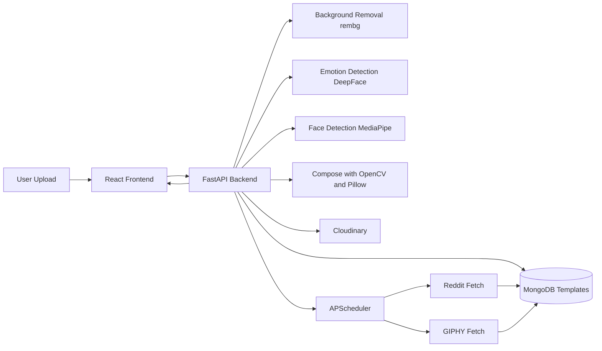

# Stikerly

Stikerly is a full-stack app that turns a selfie into a meme-style sticker formatted for WhatsApp. It combines computer vision, template metadata, and a simple web UX so users can generate a usable sticker in one flow instead of manually editing images.

## What problem it solves

Most sticker tools break down in one of three places: cutout quality, face placement, or final output format. Stikerly addresses all three in a single pipeline:

- removes background from the uploaded portrait,
- detects and crops the dominant face,
- places the face into a meme template slot with correct scale and rotation,
- exports a 512x512 transparent WebP suitable for WhatsApp sharing.

## Key features

- Emotion-aware template selection with optional manual template override.
- Automatic face-slot detection during template upload in admin flow.
- Admin template CRUD with metadata persisted in MongoDB.
- Trend ingestion from Reddit and GIPHY, including scheduled refresh jobs.
- Cloudinary integration for serving generated sticker assets.
- Frontend gallery picker, loading states, and WhatsApp share deep links.

## Architecture



### Pipeline modules

- **Cutout module:** removes background and preserves alpha channel.
- **Trend module:** manages template metadata and auto-ingestion from external feeds.
- **Factory module:** resizes, rotates, and composites user face into template face slot.
- **Shipper module:** normalizes to WhatsApp sticker constraints and returns public asset URL.

## Tech stack

**Frontend**

- React 19, TypeScript, Vite 7
- Tailwind CSS 4
- GSAP for motion

**Backend**

- FastAPI on Gunicorn/Uvicorn workers
- OpenCV, MediaPipe, Pillow, rembg, DeepFace
- APScheduler for periodic jobs

**Data and infrastructure**

- MongoDB for template registry
- Cloudinary for image asset hosting
- Docker Compose for local orchestration
- NGINX in frontend container

## API overview

### Public

- `GET /` - service health
- `GET /templates` - list templates
- `GET /admin/templates` - public read-only template list used by frontend
- `POST /create-sticker` - generate sticker from uploaded image

`POST /create-sticker` accepts `multipart/form-data`:

- `file` (required)
- `template_id` (optional; when omitted, backend chooses by emotion + fallback)

Response includes:

- `status`
- `meme_selected`
- `final_meme_url`

### Admin (`x-admin-key` required)

- `POST /admin/templates/upload`
- `POST /admin/templates`
- `DELETE /admin/templates/{template_id}`
- `POST /admin/memes/fetch/reddit`
- `POST /admin/memes/fetch/giphy`

## Template document shape

```json
{
  "id": "meme_abc123",
  "name": "Distracted Boyfriend Variant",
  "filename": "meme_abc123.png",
  "tags": ["trending", "funny", "surprised"],
  "face_slot": {
    "x": 240,
    "y": 120,
    "width": 180,
    "height": 180,
    "rotation": -8
  },
  "source": "r/memes",
  "source_url": "https://...",
  "auto_fetched": true
}
```

## Run locally

### Prerequisites

- Docker + Docker Compose (recommended)
- Optional: Python 3.10+ and Node 20+ for manual run

### Environment file

Create `backend/.env`:

```env
MONGO_URI=...
DB_NAME=stikerly
ADMIN_KEY=change-me
GIPHY_API_KEY=...
CLOUDINARY_CLOUD_NAME=...
CLOUDINARY_API_KEY=...
CLOUDINARY_API_SECRET=...
ALLOWED_ORIGINS=http://localhost:5173
```

### Start with Docker Compose

```bash
docker compose up -d --build
```

Services:

- Frontend: `http://localhost:5173`
- Backend: `http://localhost:8000`
- MongoDB: `localhost:27017`

Persistent volumes:

- `backend_uploads`
- `backend_assets`
- `mongodb_data`

### Manual run

Backend:

```bash
cd backend
python -m venv .venv && source .venv/bin/activate
pip install -r requirements.txt
uvicorn app.main:app --reload --host 0.0.0.0 --port 8000
```

Frontend:

```bash
cd frontend/stickerly-frontend
npm install
npm run dev
```

## Deployment options

### 1) Single host with Docker Compose

- Suitable for internal demos or early production.
- Run frontend, backend, and MongoDB on one VM.

### 2) Split deployment (recommended)

- Frontend on Vercel/Netlify.
- Backend on Render/Railway/Fly/ECS.
- MongoDB Atlas + Cloudinary as managed services.

### 3) Kubernetes (scale path)

- Separate services for API, scheduler, and frontend.
- Add autoscaling, managed secrets, and ingress policies.

## Current roadmap status

Completed:

- end-to-end cutout and composition pipeline,
- MongoDB-backed template registry,
- admin upload + save + delete flow,
- Reddit/GIPHY trend ingestion,
- frontend template picker and loading state UX,
- containerization and CORS configuration,
- Cloudinary-based output hosting.

Planned:

- histogram-based color matching,
- production hardening for hosted backend/frontend,
- generation quotas and paid tier,
- direct WhatsApp bot workflow via Business API.

## Notes on engineering quality

This project is intentionally built as a product system, not just an image-processing script. It covers API design, CV pipeline orchestration, admin tooling, background jobs, and deployment strategy in one codebase.
